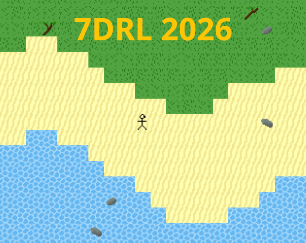

# 7DRL 2026

Entry to the [7-day Roguelike challenge](https://7drl.com/) for 2026. Itch.io page is [here](https://atkinssj.itch.io/7drl-2026).

Idea is a survival-focused game, taking a lot of inspiration from TerraFirmaCraft and Vintage Story, neither of which I've really played. We'll see how well this goes.

## Building

The build uses CMake. I don't know a lot about CMake, so these instructions may be lacking.

Set up the CMake build using something like this:

```shell
cmake -DCMAKE_BUILD_TYPE=Debug -G Ninja -B ./build/debug
```

Then compile like this:
```shell
cd ./build/debug
ninja
```

And the resulting executable will be `./build/debug/7drl-2026`.
